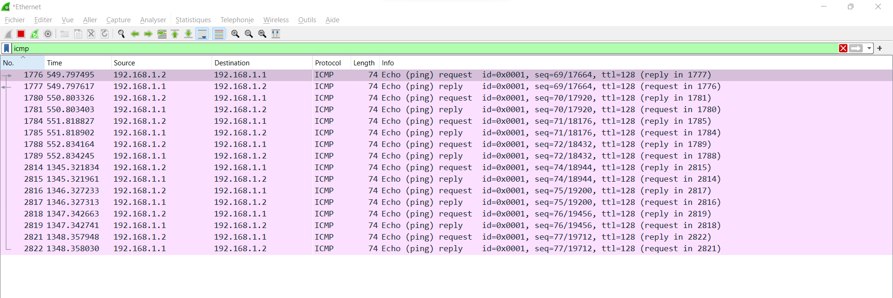

**🌞 Affichez les infos des cartes réseau de votre PC**
````
Carte réseau sans fil Wi-Fi, 4C-03-4F-88-B2-5B, 10.33.19.129
Carte Ethernet Ethernet, 08-8F-C3-8B-DF-D6 et adresse IP de l'interface Ethernet (indisponible car déconnecté du réseau)
````

**🌞 Affichez votre gateway**
````
 ipconfig 
10.33.19.254
````
**🌞 Déterminer la MAC de la passerelle**
````
arp -a
00-c0-e7-e0-04-4e
````
**🌞 Trouvez comment afficher les informations sur une carte IP (change selon l'OS)**
````
Open panneau config, réseau et internet, centre réseau et partage, wifi-Ynov, détails et TADAA.
10.33.19.129, 4C-03-4F-88-B2-5B et 10.33.19.254
````

## 2. Modifications des informations

### A. Modification d'adresse IP (part 1)  

🌞 Utilisez l'interface graphique de votre OS pour **changer d'adresse IP** :
````
Panneau Config, Réseau Internet,centre réseau et partage, wi-fi , Propriétés , IPV4
- 10.33.19.69
255.255.255.0
10.33.19.254
````
🌞 **Il est possible que vous perdiez l'accès internet.** Que ce soit le cas ou non, expliquez pourquoi c'est possible de perdre son accès internet en faisant cette opération.
````
C'est possible de perdre l'accés car si 2 personnes on la même adresse IP alors la première connecté sera prioritaire et la deuxieme n'aura rien tant que la première est connecté.
````
---

# II. Exploration locale en duo

Owkay. Vous savez à ce stade :

- afficher les informations IP de votre machine
- modifier les informations IP de votre machine
- c'est un premier pas vers la maîtrise de votre outil de travail

On va maintenant répéter un peu ces opérations, mais en créant un réseau local de toutes pièces : entre deux PCs connectés avec un câble RJ45.

## 1. Prérequis

- deux PCs avec ports RJ45
- un câble RJ45
- **firewalls désactivés** sur les deux PCs

## 2. Câblage

Ok c'est la partie tendue. Prenez un câble. Branchez-le des deux côtés. **Bap.**

## Création du réseau (oupa)

Cette étape pourrait paraître cruciale. En réalité, elle n'existe pas à proprement parlé. On ne peut pas "créer" un réseau.

**Si une machine possède une carte réseau, et si cette carte réseau porte une adresse IP**, alors cette adresse IP se trouve dans un réseau (l'adresse de réseau). Ainsi, **le réseau existe. De fait.**  

**Donc il suffit juste de définir une adresse IP sur une carte réseau pour que le réseau existe ! Bap.**

## 3. Modification d'adresse IP

🌞 **Modifiez l'IP des deux machines pour qu'elles soient dans le même réseau**
````
change Ip adress, PC1 = 10.10.10.88
PC2 = 10.10.10.222
````

🌞 **Vérifier à l'aide d'une commande que votre IP a bien été changée**
````
ipconfig 
ipv4 : 10.10.10.88    (PC1)
ipv4 : 10.10.10.222  (PC2)
````
🌞 **Vérifier que les deux machines se joignent**

````
la commande marche pour les deux :
ping 10.10.10.88 
ping 10.10.10.222
````

🌞 **Déterminer l'adresse MAC de votre correspondant**
````
arp -a
Interface : 10.10.10.88 
Adresse Internet        Adresse Physique(MAC)
10.10.10.222              **34-73-5a-ea-15-f2**
````

## 4. Utilisation d'un des deux comme gateway

Ca, ça peut toujours dépann irl. Comme pour donner internet à une tour sans WiFi quand y'a un PC portable à côté, par exemple.

L'idée est la suivante :

- vos PCs ont deux cartes avec des adresses IP actuellement
  - la carte WiFi, elle permet notamment d'aller sur internet, grâce au réseau YNOV
  - la carte Ethernet, qui permet actuellement de joindre votre coéquipier, grâce au réseau que vous avez créé :)
- si on fait un tit schéma tout moche, ça donne ça :

```schema
  Internet           Internet
     |                   |
    WiFi                WiFi
     |                   |
    PC 1 ---Ethernet--- PC 2
    
- internet joignable en direct par le PC 1
- internet joignable en direct par le PC 2
```

- vous allez désactiver Internet sur une des deux machines, et vous servir de l'autre machine pour accéder à internet.

```schema
  Internet           Internet
     X                   |
     X                  WiFi
     |                   |
    PC 1 ---Ethernet--- PC 2
    
- internet joignable en direct par le PC 2
- internet joignable par le PC 1, en passant par le PC 2
```

- pour ce faiiiiiire :
  - désactivez l'interface WiFi sur l'un des deux postes
  - s'assurer de la bonne connectivité entre les deux PCs à travers le câble RJ45
  - **sur le PC qui n'a plus internet**
    - sur la carte Ethernet, définir comme passerelle l'adresse IP de l'autre PC
  - **sur le PC qui a toujours internet**
    - sur Windows, il y a une option faite exprès (google it. "share internet connection windows 10" par exemple)
    - sur GNU/Linux, faites le en ligne de commande ou utilisez [Network Manager](https://help.ubuntu.com/community/Internet/ConnectionSharing) (souvent présent sur tous les GNU/Linux communs)
    - sur MacOS : toute façon vous avez pas de ports RJ, si ? :o (google it sinon)

---

🌞**Tester l'accès internet**

````
ping 8.8.8.8
Envoi d’une requête 'Ping' 8.8.8.8 avec 32 octets de données : 
Réponse de 8.8.8.8 : octets=32 temps=22 ms TTL=113 
Réponse de 8.8.8.8 : octets=32 temps=22 ms TTL=113 
Réponse de 8.8.8.8 : octets=32 temps=21 ms TTL=113 
Réponse de 8.8.8.8 : octets=32 temps=23 ms TTL=113`
````

🌞 **Prouver que la connexion Internet passe bien par l'autre PC**

````
tracert -d 8.8.8.8 Détermination de l’itinéraire vers 8.8.8.8 avec un maximum de 30 sauts. 
1 ms * 2 ms 192.168.137.1 
2 * * * Délai d’attente de la demande dépassé. 
3. 7 ms 6 ms 5 ms 10.33.19.254 
4. 7 ms 5 ms 5 ms 77.196.149.137 
5. 10 ms 11 ms 8 ms 212.30.97.108 
6. 27 ms 21 ms 20 ms 77.136.172.222 
7. 22 ms 22 ms 21 ms 77.136.172.221 
8. 24 ms 23 ms 23 ms 194.6.144.186 
9. 24 ms 23 ms 23 ms 194.6.144.186 
10. 24 ms 22 ms 22 ms 72.14.194.30 
11. 24 ms 23 ms 22 ms 172.253.69.49 
12. 22 ms 23 ms 22 ms 108.170.238.107 
13. 23 ms 22 ms 23 ms 8.8.8.8
````
## 5. Petit chat privé

On va créer un chat extrêmement simpliste à l'aide de `netcat` (abrégé `nc`). Il est souvent considéré comme un bon couteau-suisse quand il s'agit de faire des choses avec le réseau.

Sous GNU/Linux et MacOS vous l'avez sûrement déjà, sinon débrouillez-vous pour l'installer :). Les Windowsien, ça se passe [ici](https://eternallybored.org/misc/netcat/netcat-win32-1.11.zip) (from https://eclearternallybored.org/misc/netcat/).  

Une fois en possession de `netcat`, vous allez pouvoir l'utiliser en ligne de commande. Comme beaucoup de commandes sous GNU/Linux, Mac et Windows, on peut utiliser l'option `-h` (`h` pour `help`) pour avoir une aide sur comment utiliser la commande.  

Sur un Windows, ça donne un truc comme ça :

```schema
C:\Users\It4\Desktop\netcat-win32-1.11>nc.exe -h
[v1.11 NT www.vulnwatch.org/netcat/]
connect to somewhere:   nc [-options] hostname port[s] [ports] ...
listen for inbound:     nc -l -p port [options] [hostname] [port]
options:
        -d              detach from console, background mode

        -e prog         inbound program to exec [dangerous!!]
        -g gateway      source-routing hop point[s], up to 8
        -G num          source-routing pointer: 4, 8, 12, ...
        -h              this cruft
        -i secs         delay interval for lines sent, ports scanned
        -l              listen mode, for inbound connects
        -L              listen harder, re-listen on socket close
        -n              numeric-only IP addresses, no DNS
        -o file         hex dump of traffic
        -p port         local port number
        -r              randomize local and remote ports
        -s addr         local source address
        -t              answer TELNET negotiation
        -u              UDP mode
        -v              verbose [use twice to be more verbose]
        -w secs         timeout for connects and final net reads
        -z              zero-I/O mode [used for scanning]
port numbers can be individual or ranges: m-n [inclusive]
```

L'idée ici est la suivante :

- l'un de vous jouera le rôle d'un *serveur*
- l'autre sera le *client* qui se connecte au *serveur*

Précisément, on va dire à `netcat` d'*écouter sur un port*. Des ports, y'en a un nombre fixe (65536, on verra ça plus tard), et c'est juste le numéro de la porte à laquelle taper si on veut communiquer avec le serveur.

Si le serveur écoute à la porte 20000, alors le client doit demander une connexion en tapant à la porte numéro 20000, simple non ?  

Here we go :

🌞 **sur le PC *serveur*** avec par exemple l'IP 192.168.1.1
````
C:\Users\Bayle\netcat-1.11> .\nc.exe -l -p 8888
````
🌞 **sur le PC *client*** avec par exemple l'IP 192.168.1.2
````
PS C:\Users\Bayle\netcat-1.11> .\nc.exe -l -p 8888        (PC1)
gh
coucou
ça fonctionne
wa c tro bien
uiiiiiiiiiiiii
coucou
vroum
````
````
C:\Users\mathi\TP-réseau-03-10-2022\netcat-win32-1.11\netcat-1.11> .\nc.exe 192.168.1.1 8888                     (PC2)
gh 
coucou 
ça fonctionne 
wa c tro bien 
uiiiiiiiiiiiii 
coucou
vroum
````
---

🌞 **Visualiser la connexion en cours**
````
  TCP    192.168.1.1:8888       192.168.1.2:55861      ESTABLISHED
 [nc.exe]
 ````

```bash
# Windows (dans un Powershell administrateur)
$ netstat -a -n -b

# Linux
$ ss -atnp

# MacOS
$ netstat -a -n # je crois :D
```

🌞 **Pour aller un peu plus loin**

````
netstat -a -n -b | Select-String 8888

  TCP    192.168.1.1:8888       0.0.0.0:0              LISTENING
````
```bash
# Sur Windows/MacOS
$ nc.exe -l -p PORT_NUMBER -s IP_ADDRESS
# Par exemple
$ nc.exe -l -p 9999 -s 192.168.1.37
```

## 6. Firewall

Toujours par 2.

Le but est de configurer votre firewall plutôt que de le désactiver

🌞 **Activez et configurez votre firewall**

- firewall actif 

```
PS C:\Users\mathi\TP-réseau-03-10-2022\netcat-win32-1.11\netcat-1.11> ping 192.168.1.1 
Envoi d’une requête 'Ping' 192.168.1.1 avec 32 octets de données : 
Réponse de 192.168.1.1 : octets=32 temps<1ms TTL=128 
Réponse de 192.168.1.1 : octets=32 temps<1ms TTL=128 
Réponse de 192.168.1.1 : octets=32 temps<1ms TTL=128 
Réponse de 192.168.1.1 : octets=32 temps<1ms TTL=128 
Statistiques Ping pour 192.168.1.1: 
Paquets : envoyés = 4, reçus = 4, perdus = 0 (perte 0%),
Durée approximative des boucles en millisecondes : 
Minimum = 0ms, Maximum = 0ms, Moyenne = 0ms
```

🌞Exploration du DHCP, depuis votre PC

afficher l'adresse IP du serveur DHCP du réseau WiFi YNOV : 10.33.16.238
cette adresse a une durée de vie limitée. C'est le principe du bail DHCP (ou DHCP lease). Trouver la date d'expiration de votre bail DHCP: vendredi 7 octobre 2022 08:40:05

🌞** Trouver l'adresse IP du serveur DNS que connaît votre ordinateur**
````
8.8.8.8
````
🌞 Utiliser, en ligne de commande l'outil nslookup (Windows, MacOS) ou dig (GNU/Linux, MacOS) pour faire des requêtes DNS à la main


faites un lookup (lookup = "dis moi à quelle IP se trouve tel nom de domaine")
````
pour google.com : 142.250.179.110
pour ynov.com : 104.26.10.233
interpréter les résultats de ces commandes

serveur : dns.google : serveur dns utilise
address : 8.8.8.8  : addresse du serveur dns
nom : google.com : nom du site
Addresses :  2a00:1450:4007:80e::200e addresse ipv6
142.250.179.110 addresses ipv4
````

déterminer l'adresse IP du serveur à qui vous venez d'effectuer ces requêtes : 8.8.8.8


faites un reverse lookup (= "dis moi si tu connais un nom de domaine pour telle IP")
````
pour l'adresse 78.73.21.21 : 78-73-21-21-no168.tbcn.telia.com
pour l'adresse 22.146.54.58 : rien
interpréter les résultats
````
```
Serveur :   dns.google : nom du serveur dns
Address:  8.8.8.8 addresses serveur dns


Nom :    78-73-21-21-no168.tbcn.telia.com nom du site
Address:  78.73.21.21 addresse du site
dns.google ne parvient pas à trouver 22.146.54.58 : Non-existent domain : le site web n'existe pas
```
🌞 Utilisez le pour observer les trames qui circulent entre vos deux carte Ethernet. Mettez en évidence :




🌞 Wireshark it

déterminez à quelle IP et quel port votre PC se connecte quand vous regardez une vidéo Youtube

il sera sûrement plus simple de repérer le trafic Youtube en fermant tous les autres onglets et toutes les autres applications utilisant du réseau

````
il se connecte à l'adresse IP : 
10.33.16.237
sur le dsn de google donc :
8.8.8.8
````